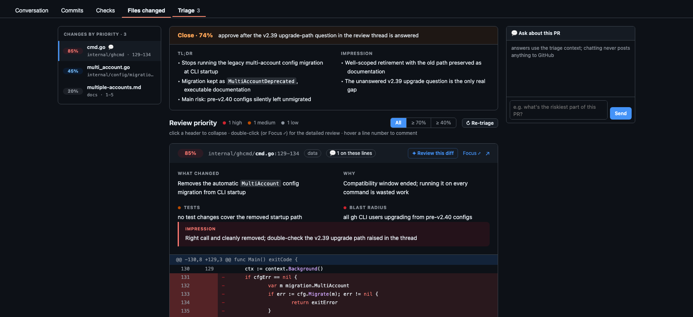

# pr-triage

Prioritize GitHub PR reviews with your local `claude` CLI. Scores every hunk of a
PR 0–100 for review-worthiness, buries mechanical noise (lockfiles, renames,
whitespace), and presents the diff in priority order — in the terminal, as an
HTML report, and as a **Triage tab injected into the GitHub PR page itself**.

Everything runs locally: `gh` fetches the PR, your own `claude` CLI does the
scoring (whatever backend your shell configures — Anthropic login, Bedrock, or
a local model via `ANTHROPIC_BASE_URL`), and a localhost daemon serves the
results. Nothing leaves your machine except comments you explicitly post.



## Install

```bash
install -m 0755 pr-triage ~/.local/bin/pr-triage
```

Prereqs: python3 (stdlib only), an authenticated `gh`, a working `claude` CLI.

For the GitHub overlay: install [Tampermonkey](https://www.tampermonkey.net),
enable Chrome's **Allow User Scripts** for it (then restart Chrome), and import
`pr-triage-overlay.user.js` via Dashboard → Utilities → Import.

## Use

```bash
pr-triage serve                 # start the local server once, leave it running
```

Then open any PR's **Files changed** tab on GitHub — a **Triage** tab appears.
Click *Triage this PR* and review from there:

- **Summary panel**: bulleted TL;DR, overall impression, and an approvability
  score with the gating item ("approve after X").
- **Priority-ordered diff cards**: GitHub-native diff tables (line gutters,
  syntax highlighting) with per-hunk What / Why / Tests-coverage / Blast-radius
  notes and a score-colored Impression.
- **Deep reviews**: pre-generated for the top hunks at triage time
  (`--auto-review N`, `--auto-review-min PCT`); drafted comments appear inline
  at their code line, editable, with **Reword** (make it sound human) and
  **Post to GitHub** buttons. Thread replies are drafted where warranted.
- **Manual comments**: hover a line number → `+` → write → post. Delete posted
  or existing comments (two-click confirm) right from the UI.
- **Chat**: ask about the whole PR (list view) or one diff (focus view),
  grounded in the triage context.
- **Navigation**: sticky priority sidebar with scroll-spy, priority filter
  chips, score badges on the real Files view that jump back into the triage,
  Esc/prev/next in focus mode, ↻ Re-triage after new commits.

CLI-only flow (no browser needed):

```bash
pr-triage owner/repo#123                      # terminal report
pr-triage owner/repo#123 --html report.html   # interactive HTML report
pr-triage owner/repo#123 --serve              # triage + publish into the server
pr-triage logs -n 50 -f                       # follow the server log
pr-triage purge owner/repo#123                # drop a stored triage (omit = all)
pr-triage help                                # full reference
```

Results persist across server restarts in `~/.local/state/pr-triage/store/`.

## Security model

The daemon binds 127.0.0.1 only, validates the Host header (anti DNS-rebind),
grants CORS solely to `https://github.com`, requires a CSRF header on state-
changing endpoints, and gates CLI-to-daemon calls (publish/purge) behind a
0600 token file. The userscript treats everything the local port serves as
untrusted: payloads are shape-validated and rendered via textContent only.

## Troubleshooting claude issues

pr-triage runs `claude -p` as a subprocess and inherits your shell's
environment, so almost every failure is really a `claude` setup issue.
First check both of these — they must work in the same shell/state the
server runs in:

```bash
claude auth status        # loggedIn should be true (or a backend env var set)
pr-triage logs -n 30      # server-side errors land here
```

**`API Error: Unable to connect … (ConnectionRefused)`** — your shell points
`claude` at a local/proxy backend that isn't running. Check for
`ANTHROPIC_BASE_URL` / `ANTHROPIC_AUTH_TOKEN` in `env | grep ANTHROPIC` and in
`~/.zshrc` (e.g. an LM Studio experiment on `localhost:1234`). Either start
that server, or remove the exports and run `claude /login`. Two gotchas:
editing `~/.zshrc` does **not** fix already-open terminals (run
`unset ANTHROPIC_BASE_URL ANTHROPIC_AUTH_TOKEN` or open a new tab), and the
daemon captures its environment at startup — restart `pr-triage serve` after
fixing.

**`Not logged in · Please run /login`** — the CLI has no credentials in this
context: `claude /login` once, then restart the server.

**Scoring hangs or times out** — local models are slow; try
`pr-triage serve --parallel 1 --timeout 1200`, and smaller batches via
`--batch-chars 30000`.

**`model output unparseable after retry`** — the model isn't returning valid
JSON (each call already gets one automatic retry). Usually a too-small local
model; try `--model sonnet` or a larger local model.

**Running inside a Claude Code session** — pr-triage strips the nested-session
markers (`CLAUDECODE`, `CLAUDE_CODE_ENTRYPOINT`, `CLAUDE_CODE_SSE_PORT`)
automatically, but keeps auth/backend vars like `CLAUDE_CODE_OAUTH_TOKEN` and
`CLAUDE_CODE_USE_BEDROCK` intact.

**Isolate the model entirely** — run against the bundled stub to prove the
rest of the pipeline works: `pr-triage owner/repo#1 --claude-bin ./stub_claude`.
If that succeeds, the problem is your `claude` setup, not pr-triage.

## Development

```bash
python3 test_parser.py                 # unit + regression tests
./pr-triage owner/repo#1 --claude-bin ./stub_claude   # model-free e2e (stub backend)
./pr-triage serve --claude-bin ./stub_claude          # stub-backed server
```

`stub_claude` emulates the `claude -p --output-format json` envelope for the
scoring, deep-review, reword, and chat prompts.
